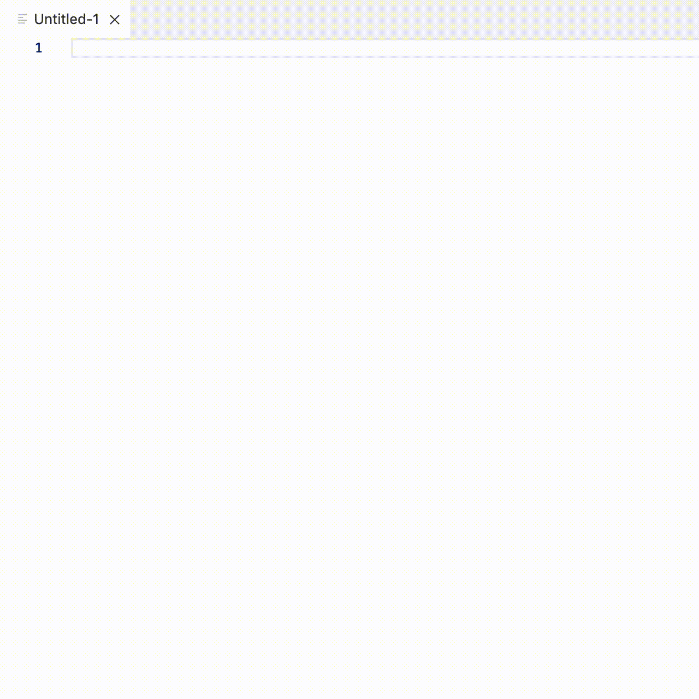

# Visual Studio Code Beamer Extension

This extension adds Beamer snippets for Visual Studio Code.

## Features

* Snippets
  * Available snippets: `beamer`, `beamerdetail`, `frame`, `framesub`, `framefull`, `tableofcontents`, `columnstwo`, `columnsthree`, `block`, `alertblock`, `definition`, `example`, `settheme` 

  * Demo
  
    

## Requirements

* You need to install an extension that adds `Latex` as a language mode. Otherwise, this extension will not be activated since Visual Studio Code doesn't recognize `Latex` as a language mode by default and this extension only activates if you edit a `Latex` file.

<!--

\!\[feature X\]\(images/feature-x.png\)

## Requirements

If you have any requirements or dependencies, add a section describing those and how to install and configure them.

## Extension Settings

Include if your extension adds any VS Code settings through the `contributes.configuration` extension point.

For example:

This extension contributes the following settings:

* `myExtension.enable`: enable/disable this extension
* `myExtension.thing`: set to `blah` to do something

## Known Issues

Calling out known issues can help limit users opening duplicate issues against your extension.

## Release Notes

Users appreciate release notes as you update your extension.

### 1.0.0

Initial release of ...

### 1.0.1

Fixed issue #.

### 1.1.0

Added features X, Y, and Z.
-->